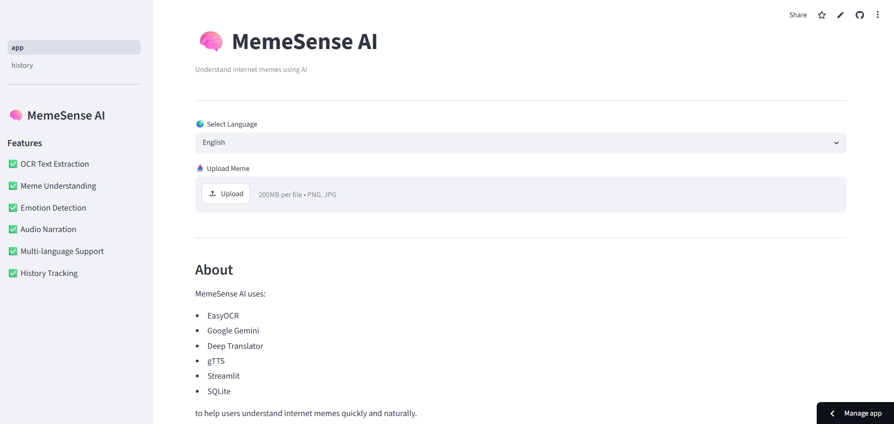
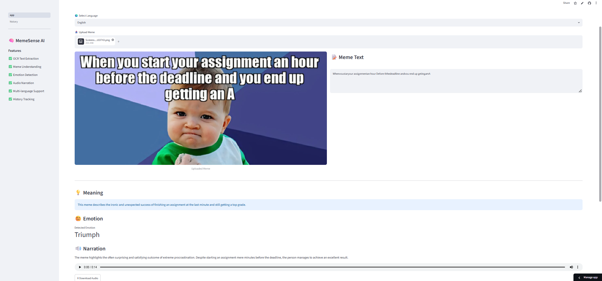
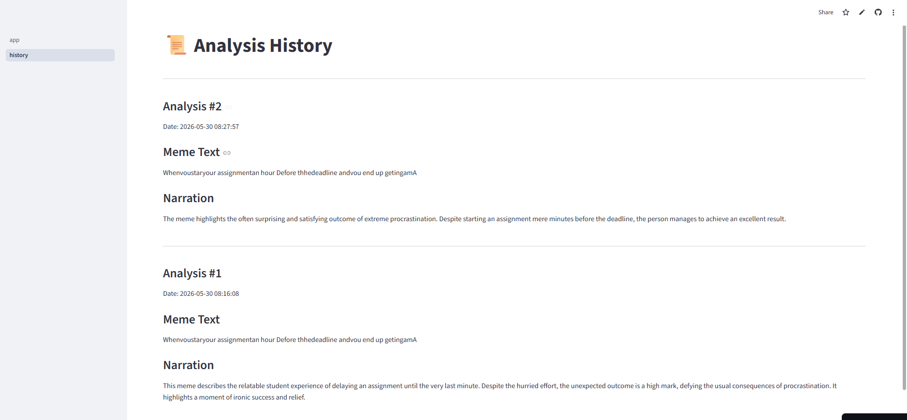

# 🧠 MemeSense AI

## 🚀 AI-Powered Meme Understanding Platform

🌐 Live Demo: https://memesense-ai-qgrhfvc76nj8bsqipnu4gc.streamlit.app/

MemeSense AI is an intelligent AI application that understands internet memes by extracting text from images, analyzing meaning, detecting emotions, generating explanations, and converting them into audio narration.

It combines **Computer Vision, OCR, Large Language Models (LLMs), NLP, Translation APIs, and Text-to-Speech** into a complete end-to-end AI pipeline.

---

## 📸 Project Screenshots

### 🏠 Home Page


### 🔍 Meme Analysis Output


### 📊 History Page


---

## ✨ Features

### 📸 Meme Upload
- Upload memes in JPG / JPEG / PNG format

### 🔍 OCR Text Extraction
- Extracts text using **EasyOCR**
- Handles noisy and stylized meme text

### 🧠 AI Meme Understanding
- Powered by **Google Gemini 2.5 Flash**
- Understands meme context, humor, and intent

### 😊 Emotion Detection
- Happy 😊
- Sad 😢
- Angry 😠
- Excited 🤩
- Confused 😕
- Relaxed 😌

### 💡 Meaning Generation
- Converts meme text into short, clear explanations

### 🔊 Audio Narration
- Converts explanation into speech using **gTTS**

### 🌍 Multi-Language Support
- English 🇬🇧
- Hindi 🇮🇳
- Marathi 🇮🇳

### 🗄 History Tracking
- Stores past analyses using **SQLite**


## 🏗 System Architecture

```text
Image Upload
    ↓
EasyOCR (Text Extraction)
    ↓
Google Gemini LLM
    ↓
┌───────────────┬───────────────┬───────────────┐
│ Meaning       │ Emotion       │ Explanation   │
└───────────────┴───────────────┴───────────────┘
    ↓
Translation Layer
    ↓
Text-to-Speech (gTTS)
    ↓
Audio Output + SQLite Storage

📁 Project Structure


MemeSense-AI/
│
├── app.py
├── requirements.txt
├── README.md
├── .env (not uploaded)
├── .gitignore
│
├── assets/
│ ├── home.png
│ ├── analysis.png
│ └── history.png
│
├── data/
│ ├── uploads/
│ └── audio/
│
├── database/
│ └── memes.db
│
├── services/
│ ├── ocr_service.py
│ ├── gemini_service.py
│ ├── translation_service.py
│ ├── speech_service.py
│ └── db_service.py
│
├── pages/
│ └── History.py
│
└── .streamlit/
└── config.toml


🛠 Tech Stack

- Frontend: Streamlit  
- OCR: EasyOCR  
- AI Model: Google Gemini 2.5 Flash  
- Translation: Deep Translator  
- Speech: gTTS  
- Database: SQLite  
- Language: Python  

---

 ⚙️ Installation

 Clone Repository
```bash
git clone https://github.com/Muskan2771/MemeSense-AI.git
cd MemeSense-AI
Install Dependencies
pip install -r requirements.txt
Create Environment File
GEMINI_API_KEY=YOUR_API_KEY
Run Application
streamlit run app.py
🎯 Example Output
Input Meme
NO STRESS
JUST VIBING
Output

💡 Meaning
Enjoying life without worrying too much.

😊 Emotion
Relaxed

🧠 Explanation
This meme expresses a carefree attitude and enjoying the moment.

🔊 Audio
Generated MP3 narration available for playback.

💼 Resume Highlights
Built AI-powered meme understanding platform using OCR + LLMs
Integrated Google Gemini for contextual meme interpretation
Implemented EasyOCR-based text extraction pipeline
Developed multilingual NLP system (English, Hindi, Marathi)
Added text-to-speech narration using gTTS
Built SQLite-based history tracking system
Deployed full-stack AI app using Streamlit
🔮 Future Improvements
Gemini Vision integration (image + text reasoning)
Meme template classification model
Browser extension for instant meme explanation
Real-time meme API
Mobile application
👩‍💻 Author

Muskan Shaikh
Aspiring Data Scientist | AI/ML Developer | Python Engineer

GitHub: https://github.com/Muskan2771
LinkedIn: https://linkedin.com/in/musu-shaikh
